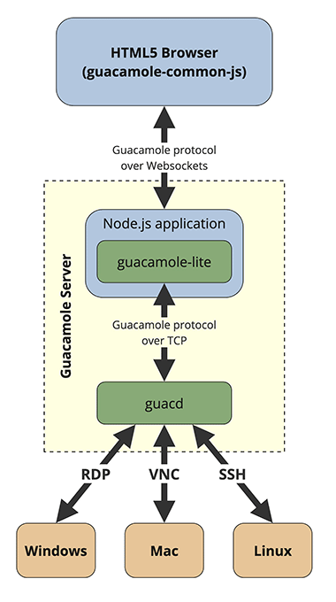

# guacamole-lite

## Introduction

### What is `guacamole-lite`?

`guacamole-lite` is a lightweight Node.js library designed to create servers compatible with the Guacamole protocol.

### What is Guacamole?

Apache Guacamole is an HTML5 web client for remote desktop environments, utilizing protocols such as VNC, RDP, SSH, or
Telnet.

### Why use `guacamole-lite`?

Unlike the Java-based original `guacamole-client`, which is a full-featured client with its own user and host management
system, `guacamole-lite` is tailored for integration into existing applications. It is particularly suitable for systems
that already have user, host, and credential management in place, offering a more streamlined approach to adopting the
Guacamole protocol.

The main differences between `guacamole-lite` and the Java-based `guacamole-client` are:

- **Integration-Friendly**: `guacamole-lite` is built to be easily integrated into existing applications, allowing
  developers to leverage their own systems for managing users, hosts, and credentials. In contrast, `guacamole-client`
  comes with a comprehensive suite of features, including its own database for user and host management, which can make
  integration into existing systems more challenging.

- **Node.js Based**: The library is written in Node.js, which provides a more accessible and flexible development
  experience compared to the Java-based `guacamole-client`. This makes `guacamole-lite` easier to extend, modify, and
  integrate into modern web applications.

- **Resource Efficiency**: `guacamole-lite` is less resource-intensive, making it a more efficient choice for
  environments where resource optimization is crucial.

By focusing on these key areas, `guacamole-lite` offers a compelling option for developers looking to implement remote
desktop capabilities within their Node.js applications.

## Architecture Overview

`guacamole-lite` is designed to seamlessly fit into the
broader [Guacamole ecosystem](https://guacamole.apache.org/doc/gug/guacamole-architecture.html), providing an efficient
way to develop Guacamole-compatible servers in Node.js. The following diagram illustrates the typical architecture of a
Guacamole deployment and how `guacamole-lite` integrates within it:



The diagram shows the following components:

1. **HTML5 Browser (guacamole-common-js)**: This is the user's interface, an HTML5 application that runs in the browser.
   The user interacts with this layer to access remote desktop sessions. The application
   uses [guacamole-common-js](https://guacamole.apache.org/doc/gug/guacamole-common-js.html), a library
   that provides the Guacamole protocol implementation in JavaScript.

2. **Guacamole Protocol**: This communication protocol is used by `guacamole-common-js` to interact with `guacd`
   via `guacamole-lite`, which acts as a proxy. Check out
   the [Guacamole protocol](https://guacamole.apache.org/doc/gug/guacamole-protocol.html) documentation for more
   details.

3. **Node.js Application**: A Node.js application that integrates the `guacamole-lite` package. It provides the
   configuration to `guacamole-lite` and handles business logic, such as session management.

4. **`guacamole-lite` Package**: As a Node.js application component, `guacamole-lite` implements the handshaking of the
   Guacamole protocol and further forwards Guacamole protocol instructions between `guacamole-common-js` (over
   WebSockets) and `guacd` (over TCP or Unix socket).

5. **`guacd`**: A core component of the Guacamole infrastructure, `guacd` translates Guacamole protocol
   instructions into native remote desktop protocol commands. See
   the [Guacamole architecture](https://guacamole.apache.org/doc/gug/guacamole-architecture.html)
   documentation for more details.

6. **Guacamole Server**: A server that hosts the `Node.js application` with the `guacamole-lite` package
   and `guacd`. These components are typically deployed together, but they can also be separated into different
   machines.

7. **Remote Desktop Protocols**: The bottommost layer includes the various protocols handled by `guacd`:
    - **RDP (Remote Desktop Protocol)**: Primarily used for connecting to Windows machines.
    - **VNC (Virtual Network Computing)**: Connects to various operating systems, including Windows, Mac, and Linux.
    - **SSH (Secure Shell)**: Used for secure command-line access to Linux and Unix-like systems.

**Overall Data Flow**:

- A user initiates a remote desktop session from their browser.
- The browser communicates with `guacamole-lite` via WebSockets.
- `guacamole-lite` forwards the instructions to `guacd` using the Guacamole protocol.
- `guacd` interacts with the remote desktop system using the appropriate protocol (RDP, VNC, or SSH).
- The remote system responds back through the chain: from `guacd` to `guacamole-lite`, through WebSockets, and finally
  to the user's browser, allowing the user to see and control the remote desktop.

The entire process is encapsulated within the "Guacamole server" setup, indicating that both `guacamole-lite`
and `guacd` are integral parts of the server infrastructure. This architecture allows `guacamole-lite` to provide a
lightweight and flexible solution for integrating remote desktop capabilities into Node.js applications.

## Installation

To install `guacamole-lite` in your Node.js project, run the following command:

```sh
npm install guacamole-lite --save
```

This will add `guacamole-lite` as a dependency to your `package.json` file and download it to the `node_modules`
directory.

## Before You Start

Before you start, make sure you have `guacd` installed and running on your server.
The easiest way to run `guacd` is to use the official Docker image:

```sh
docker run --name guacd -d -p 4822:4822 guacamole/guacd
```

Alternatively, you can install `guacd` from source. For more details, refer to the official documentation on
[Installing guacamole-server](https://guacamole.apache.org/doc/gug/installing-guacamole.html#installing-guacamole-server)
or the `guacamole-server` [README](https://github.com/apache/guacamole-server/blob/master/README) on GitHub.

## Quick Start Guide

To get started with `guacamole-lite` and create a Guacamole-compatible server, follow the basic example below. For
advanced configuration options, please refer to the relevant sections of
the [advanced configuration documentation](docs/advanced-configuration.md).

### Basic `guacamole-lite` Server Setup

Here's a minimal example to set up a `guacamole-lite` server:

```javascript
const GuacamoleLite = require('guacamole-lite');

const websocketOptions = {
    port: 8080 // WebSocket server port
};

const guacdOptions = {
    port: 4822 // guacd server port
};

const clientOptions = {
    crypt: {
        cypher: 'AES-256-CBC',
        key: 'MySuperSecretKeyForParamsToken12' // Use a secure key
    }
};

const guacServer = new GuacamoleLite(websocketOptions, guacdOptions, clientOptions);
```

This code will start a WebSocket server that interfaces with the Guacamole daemon (`guacd`) and handles client
connections securely.

### Connecting to the Server

To connect to the server, your application needs to create a WebSocket connection and pass the connection parameters to
the server. The connection parameters are passed in an encrypted token in the query string of the WebSocket URL.

```
ws://your-guacamole-server:8080/?token=token
```

The encrypted token is a JSON object that is **base64-encoded and encrypted**. It can be used to either create a new
connection or join an existing one.

#### Creating a New Connection

To create a new remote desktop session, the `connection` object in your token must include a `type` property and the
necessary `settings` for that protocol.

```javascript
const crypto = require('crypto');

const CIPHER = 'aes-256-cbc';
const SECRET_KEY = 'MySuperSecretKeyForParamsToken12';

const tokenObject = {
    connection: {
        type: "rdp",
        settings: {
            "hostname": "10.0.0.12",
            "username": "Administrator",
            "password": "pAsSwOrD",
            "enable-drive": true,
            "create-drive-path": true,
            "security": "any",
            "ignore-cert": true,
            "enable-wallpaper": false
        }
    }
};

function encryptToken(value) {
    const iv = crypto.randomBytes(16);
    const cipher = crypto.createCipheriv(CIPHER, Buffer.from(SECRET_KEY), iv);

    let encrypted = cipher.update(JSON.stringify(value), 'utf8', 'base64');
    encrypted += cipher.final('base64');

    const data = {
        iv: iv.toString('base64'),
        value: encrypted
    };

    const json = JSON.stringify(data);
    return Buffer.from(json).toString('base64');
}

const token = encryptToken(tokenObject);
console.log(`ws://localhost:8080/?token=${encodeURIComponent(token)}`);
```

#### Joining an Existing Connection

To join an active session, the `connection` object must instead specify the `join` property with the unique ID of the
session you wish to join. This is mutually exclusive with the `type` property.

```javascript
const crypto = require('crypto');

const CIPHER = 'aes-256-cbc';
const SECRET_KEY = 'MySuperSecretKeyForParamsToken12';

const tokenObject = {
    connection: {
        join: "$b447679c-0541-4b3d-821b-74389e9dfb16",
        settings: {
            "read-only": true,
            "width": 1920,
            "height": 1080,
            "dpi": 96,
            "audio": ["audio/L16"],
            "video": "video/webm",
            "image": ["image/png", "image/jpeg"],
            "timezone": "America/New_York"
        }
    }
};

function encryptToken(value) {
    const iv = crypto.randomBytes(16);
    const cipher = crypto.createCipheriv(CIPHER, Buffer.from(SECRET_KEY), iv);

    let encrypted = cipher.update(JSON.stringify(value), 'utf8', 'base64');
    encrypted += cipher.final('base64');

    const data = {
        iv: iv.toString('base64'),
        value: encrypted
    };

    const json = JSON.stringify(data);
    return Buffer.from(json).toString('base64');
}

const token = encryptToken(tokenObject);
console.log(`ws://localhost:8080/?token=${encodeURIComponent(token)}`);
```

The connection ID is provided by the server when the initial session is established. For more details on obtaining this
ID and other join-specific options, please see
the [Joining Existing Connections](docs/advanced-configuration.md#joining-existing-connections) section in the advanced
configuration documentation.

#### Token Encryption

The token is encrypted for security reasons because it contains sensitive information, such as login credentials to the
remote host, and to prevent tampering with the parameters, which could lead to using the server as a proxy for malicious
purposes (see [Security Considerations](#security-considerations)).

For details on how to structure the parameters and implement encryption, refer to
the [Client Options](docs/advanced-configuration.md#client-options) section in the advanced configuration documentation.
For practical examples of how to encrypt the token in different programming languages, check out
the [examples](examples) directory:

- [Node.js Example](examples/encrypt_token.js)
- [PHP Example](examples/encrypt_token.php)
- [Python Example](examples/encrypt_token.py)

## Security Considerations

Unlike the full `guacamole-client`, `guacamole-lite` does not maintain its own database for managing users, remote
hosts, and credentials. Instead, it relies on the integrating application to supply these parameters. Since the
transmission of these parameters occurs through potentially insecure channels, such as the client's browser, it is
crucial to ensure their security and integrity. To address these concerns, `guacamole-lite` employs encrypted tokens to
pass connection details.

An encrypted token is a secure method of transmitting information where the data is first converted into ciphertext
using an encryption algorithm and a secret key. This process ensures two critical aspects:

- **Authentication**: The encrypted token verifies that the connection parameters were indeed generated by the
  application and have not been forged or tampered with by any third party.

- **Confidentiality**: Sensitive information, such as login credentials to the remote host, remains concealed from the
  client. Only `guacamole-lite` and the application that generated the token can decrypt and access the contained
  information.

For more detailed security guidelines and best practices, please refer to
the [Encryption and Security](docs/advanced-configuration.md#encryption-and-security) section in the advanced
configuration documentation.

## Advanced Configuration

Most likely you will need to customize `guacamole-lite` beyond the basic setup. The advanced configuration options allow
for fine-tuning of the WebSocket server, `guacd` communication, default connection settings, and more. Below is an
outline of the advanced configuration topics covered in the documentation:

- [WebSocket Options](docs/advanced-configuration.md#websocket-options)
    - [Configuration](docs/advanced-configuration.md#configuration)
- [Guacd Options](docs/advanced-configuration.md#guacd-options)
    - [Default `guacd` Instance Configuration](docs/advanced-configuration.md#default-guacd-instance-configuration)
    - [Dynamic `guacd` Routing](docs/advanced-configuration.md#dynamic-guacd-routing)
- [Client Options](docs/advanced-configuration.md#client-options)
    - [Encryption and Security](docs/advanced-configuration.md#encryption-and-security)
    - [Connection Settings](docs/advanced-configuration.md#connection-settings)
    - [Allowed Unencrypted Connection Settings in Query](docs/advanced-configuration.md#allowed-unencrypted-connection-settings-in-query)
    - [Connection Types](docs/advanced-configuration.md#connection-types)
    - [Joining Existing Connections](docs/advanced-configuration.md#joining-existing-connections)
    - [Logging](docs/advanced-configuration.md#logging)
- [Callbacks](docs/advanced-configuration.md#callbacks)
    - [`processConnectionSettings` Callback](docs/advanced-configuration.md#processconnectionsettings-callback)
    - [`sessionRegistry` Callback](docs/advanced-configuration.md#sessionregistry-callback)
- [Events](docs/advanced-configuration.md#events)
    - [`open` Event](docs/advanced-configuration.md#open-event)
    - [`close` Event](docs/advanced-configuration.md#close-event)
    - [`error` Event](docs/advanced-configuration.md#error-event)
- [Integration with Node.js Frameworks](docs/advanced-configuration.md#integration-with-nodejs-frameworks)
    - [Considerations for Integration](docs/advanced-configuration.md#considerations-for-integration)
    - [Example of Integrating with Express.js](docs/advanced-configuration.md#example-of-integrating-with-expressjs)
- [Additional Examples and Resources](docs/advanced-configuration.md#additional-examples-and-resources)
    - [Contents of the Examples Directory](docs/advanced-configuration.md#contents-of-the-examples-directory)

Each section provides detailed information and examples to help you tailor `guacamole-lite` to your specific needs.
Whether you're integrating with existing Node.js frameworks, handling complex logging requirements, or setting up custom
callbacks and events, the advanced configuration guide has you covered.

## Testing

`guacamole-lite` comes with two ways to test:

1. **Unit/Integration Tests:** A suite of tests is included to ensure the stability and reliability of the core library
   functions. To run these tests:

   ```sh
   npm test
   ```

2. **End-to-End Testing Environment (`test-guac`):** For more comprehensive testing, the `test-guac` directory provides
   a full end-to-end environment using Docker Compose. This setup simulates a real-world deployment scenario with
   multiple `guacd` instances, dynamic routing, and session join tracking.

**Components:**

* `guacd-1`, `guacd-2`, `guacd-3`: Multiple instances of the core Guacamole proxy daemon to demonstrate dynamic routing.
* `desktop-linux`: A sample Ubuntu Linux desktop with RDP and VNC installed, serving as the remote machine.
* `guacamole-lite-server`: An instance of the `guacamole-lite` server running within a Node.js container.
* `guacamole-lite-client`: A simple Nginx container serving an HTML page that uses the official `guacamole-common-js`
  library to connect to the `guacamole-lite-server`. It includes example code for generating the connection
  token (though this should be done server-side in production).
* `admin-dashboard`: A web-based dashboard that provides a real-time view of the session registry, showing active
  sessions and tracking all joined connections.

**How to Use `test-guac`:**

* Navigate to the `test-guac` directory:
  ```sh
  cd test-guac
  ```
* Build and start all containers in detached mode:
  ```sh
  make up
  ```
  *Alternatively, you can use `docker compose up --build -d`.*
* Once the containers are running, you can access the test environment:
    * **Guacamole Client**: `http://localhost:9090`
    * **Admin Dashboard**: `http://localhost:9092`
* To stop and remove the containers and associated volumes:
  ```sh
  make down
  ```
  *Alternatively, you can use `docker compose down -v --remove-orphans`.*

This end-to-end setup is invaluable for testing the integration between the browser client, `guacamole-lite`, `guacd`,
and the target remote desktop.

## Contributing

Contributions to `guacamole-lite` are welcome! If you're interested in contributing, you can:

- Report issues or suggest features
  by [submitting an issue on GitHub](https://github.com/vadimpronin/guacamole-lite/issues).
- Contribute code by forking the repository, making your changes, and creating a pull request.

### Development Setup

To work on the code, clone the repository and install the dependencies:

```sh
git clone https://github.com/vadimpronin/guacamole-lite.git
cd guacamole-lite
npm install
```

#### Managing Vendored Dependencies

This project includes some third-party code directly in the `lib/vendor` directory. This approach is used for critical
dependencies, like the official `Guacamole.Parser`, which are not published as standard packages on npm. This ensures
reliability and avoids complex installation issues.

**Please do not edit vendored files directly.**

To update these dependencies to their latest versions from their source repositories, run the dedicated npm script:

```sh
npm run update-vendors
```

This command will automatically download the files specified in `scripts/update-vendors.js` and place them in the
correct location.

## Acknowledgements

Special thanks to the Guacamole team for creating the original Guacamole project and making it available under the
Apache-2.0 license.
I also want to acknowledge all individual contributors to the project who have invested their time and effort into
improving `guacamole-lite`.

## License

`guacamole-lite` is made available under the Apache License, Version 2.0 (Apache-2.0), the same license as the original
Apache Guacamole project. This license is a permissive open-source license that allows for broad freedom in usage and
distribution.

For more details about the Apache-2.0 license and your rights under it, please see
the [LICENSE](https://github.com/vadimpronin/guacamole-lite/blob/master/LICENSE) file included in the repository.
